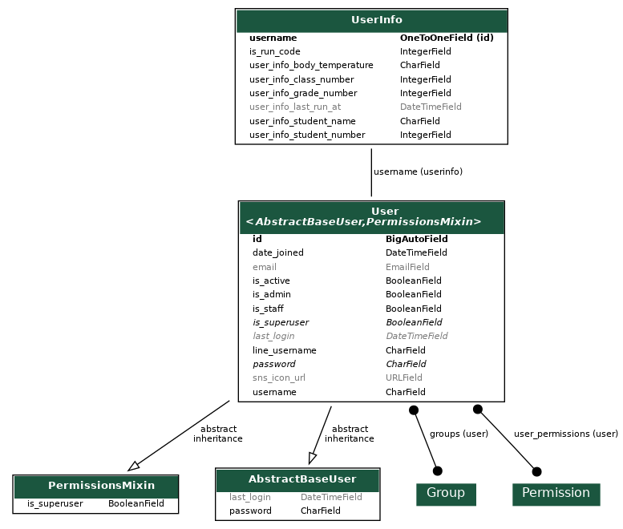
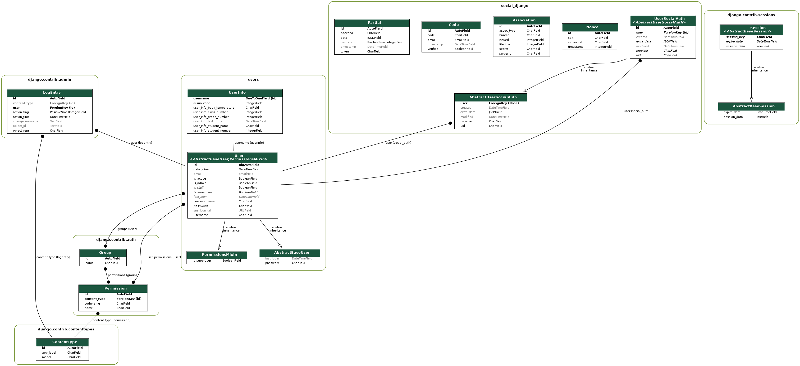

# auto_kenkou_kansatu
健康観察を自動入力するシステムに、初期情報を入力するためのサイトです

## EC2サーバーで公開中です

http://13.115.159.130/


## 開発背景

コロナが流行りだしてすぐのころ、感染症対策で毎日検温して、webのフォームで報告することになりました

朝起きるのが苦手だった私は遅刻しそうになり、入力できないことが多々あり、前日に入力出来ればいいのにと感じていました<br>
また、都度フォームに入力するのが面倒だったため、自動化できないかと考えていました

そこでクローラーから自動で入力するシステムを作りました<br>
友人に話したところ、好評だったので、他の人が使えるように入力内容を登録するため、このサイトを作りました


## 使用技術

- フロントエンド
    - HTML/CSS
    - Javascript(bootstrap 4使用)

- バックエンド
    - Python3
    - Django
    - Selnium


- インフラ・開発環境
  - GitHub Actions (CI)
  - Git/GitHub
  - VSCode
  - Heroku
  - AWS(EC2) (Heroku有料化後に移行)
  - Nginx
  - uWSGI


## 実装機能

- 基本機能
  - 新規会員登録・ログイン機能
  - 使い方説明
  - ゲストログイン機能(ポートフォリオ閲覧用に使用することを想定)

- ログイン後機能
- 情報登録
- 情報更新
- 登録した情報の確認


## インフラ構成図

※ AWSに移行した後のインフラ図です


## ER図

### アプリだけ



### 全体




## その他設計資料

### <全体>


### <サイト>


## 工夫点

- Lineログインに対応
  パスワードを登録する手間を無くすためにLineからログインできるようにしました
- UI UX
  ユーザが何をしたら良いか分かりやすいように

  データの状態によって不必要なボタンを表示しないようにしました


  また、スマホからのアクセスも考慮して、レスポンス対応をしました

- テスト
  動作を保障できるようにするために

  テストコードを作成し、GitHub Actionsを使ってプルリクエスト時にCIが動くように設定しました


## 何を重視して技術選定したか

どんな技術を使うか考える上で、以下3つの点を念頭に考えました

1. 開発コストが低いこと
2. 無料で使える
3. 大量のデータを扱わない (多くても100人分のデータまで)


### 　1. 開発コストが低いこと

開発背景でもお話させて頂いた通り、このサイトはニーズがあることに気づき、急遽開発したものです


1分1秒でも早く作成して、友人のニーズが枯渇する前にリリースする必要があったため、

開発コストが低いもの、既に知っている技術を中心に選択しました

### 　2. 無料で使える

想定使用人数 ~10人, 稼働数か月ぐらいの規模を想定していたので
コストを抑えて開発できる選択肢を選びました


### 　3. 大量のデータを扱わない

想定使用人数 ~10人(多くて100人), 稼働数か月ぐらいの規模を想定して技術を選びました


## 技術選定理由

### バックエンド・フロントエンド：Python / Django

役割：フロントからバックエンドまで

他選択肢：Ruby / Rails・Pythonフレームワーク(FastAPI,Flask)等

採用理由：

- 既に使ったことがあるPythonで使えるものから選択
- Djangoを少しかじっていたので、学習コストが低いと判断
- Ruby on Rils なども検討したが、Djangoがより学習コストが低いと判断しました


## DB：Sqlite3

役割：データの保存

他選択肢：Postgres・MySQL等

採用理由：

- MySQLは使ったことがなかったため、選択肢から除外
- 処理速度で優れること、扱いの手軽さ(ファイル形式)からSqlite3を選択しました
- Sqlite3は大量データ処理、セキュリティ面で劣るが、今回の用途では問題にならない範囲だと判断しました


## ウェブサーバー：Nginx

他選択肢：Apache

採用理由：

- 使用経験があるため、開発コストを下げられる
- Apacheは早期または簡易的なセットアップに向いているが、学習コストを考えるとNginxの方が開発コストが少ないと判断
- Nginxはアクセスが多くなっても、Apacheよりパフォーマンスが優れるため


## APサーバー：

他選択肢：uWSGI

採用理由：

- 違いが分からない(uWSGIの方が高速?)ため、使用経験があるuWSGIを選択


### デプロイ先：Heroku

役割：本番環境の運用

他選択肢：AWS・GCPなど

採用理由：

- 無料で使えること(当時)
- 学習コストは Heroku<AWS<GCP で一番学習コストが低い
- Herokuはレスポンスの速さで劣るが、今回の用途では問題にならない範囲だと判断しました

### CI/CDツール：GitHub Actions

役割：自動でテスト・デプロイを行う

他選択肢：CircleCI・Jenkins・TravisCI等

採用理由：

- テストをすることを考えるとCIの導入は必須
- HerokuがGithubとのCDに対応しているためGitHub Actionsを使ったCIだけで十分だと判断しました
- GitHub ActionsはGitHub+αなため、開発コストを減らせるため


### クローラー：Selenium

役割：フォームの自動入力を実行する

他選択肢：requests+BeautifulSoup4 など

採用理由：

- 動的なサイトにも対応するため
- 安定した動作を実現したかったため、動的な待機ができるSeleniumを選択


## こだわったところ

- Lineログインに対応
  パスワードを登録する手間を無くすためにLineからログインできるようにしました
- UI UX
  ユーザが何をしたら良いか分かりやすいように

  データの状態によって不必要なボタンを表示しないようにしました

- テスト
  動作を保障できるようにするために

  テストコードを作成し、GitHub Actionsを使ってプルリクエスト時にCIが動くように設定しました


## 設計資料

<details>
<summary>設計資料</summary>

## <全体>

## <サイト>

</details>


## how to setup

1. リポジトリをクローンします

    `git clone git@github.com:ANKM0/auto_kenkou_kansatu.git`


2. LINE TOKENとChannel ID を控えておきます(取得方法は省略)


3. 以下のコマンドを実行してSECRET_KEYを作成します

    ```cmd
    python manage.py shell
    from django.core.management.utils import get_random_secret_key
    get_random_secret_key()
    ```

4. ルートフォルダ(auto_kenkou_kansatu)直下に.envファイルを作成します

    ```cmd
    cd auto_kenkou_kansatu
    touch .env
    ```

5. .env_sanpleを参考に環境変数を入力します

    ```cmd
    SECRET_KEY='_hq51hv^!3s!i0jq!$*_q%$m7w1$f'
    SOCIAL_AUTH_LINE_KEY=1234567 # Channel ID
    SOCIAL_AUTH_LINE_SECRET="qawsedrftgyhujikolp"  # Channel secret
    ```

6. 以下のコマンドを実行してローカルサーバーを立ち上げます

    ```cmd
    python manage.py makemigrations
    python manage.py migrate
    python manage.py runserver
    ```
